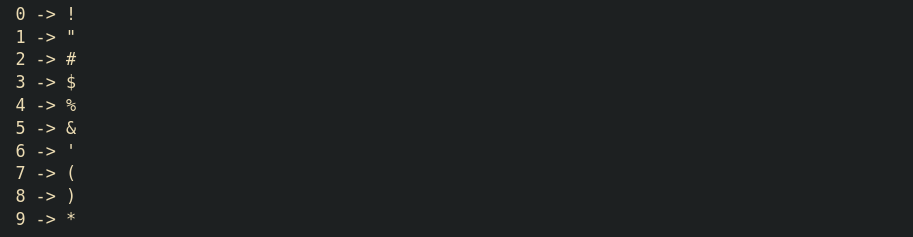

This is a very short summary on **Byte-Pair encoding**, focusing on its mechanism rather than its underlying principles.^[BPE started as a compression algorithm; NLP adopted it as a tokenization scheme.]

The core idea is to iteratively merge frequent text segments and assign them a unique ID. The final dictionary we build is called vocabulary.

"In the beginning there was the word", just kidding, we have individual letters, numbers, and some "symbols", which totals $2^8 = 256$ possible values in 8-bit representation. Call this base set $V_0$, so $|V_0| = 256$.

```python
import tiktoken

tokenizer = tiktoken.get_encoding("gpt2")
for i in range(10):
    print(f"{i} -> {tokenizer.decode([i])}")
```

{fig-alt="Printed token IDs 0–9 from the GPT-2 tokenizer"}

BPE then expands upon this initial vocabulary. One might wonder about the limitations of byte array representation: In a byte array, each element or character is mapped to a unique number, meaning a string of $N$ characters is a sequence of length $N$. However, human language often exhibits frequent patterns, where specific character sequences appear repeatedly. These frequent patterns deserve their own unique IDs. Each merge grows the vocabulary by one,

$$
|V_{t+1}| = |V_t| + 1,
$$

while typically shortening the encoded sequence — we trade a larger $|V|$ for a smaller sequence length.

Here is one merge step on a tiny string — count adjacent pairs, then replace the winner. For a sequence $x = (x_1,\ldots,x_n)$, the count of an adjacent pair $(a,b)$ is

$$
c(a,b) = \bigl|\{ i : x_i = a,\ x_{i+1} = b \}\bigr|,
$$

and the merge picks $\arg\max_{(a,b)} c(a,b)$.

```{=html}
<video class="manim-video" controls playsinline preload="metadata" style="width:100%;max-width:42rem;">
  <source src="bpe_merge.mp4" type="video/mp4">
</video>
<p class="figure-caption"><em>Figure: one BPE merge — <code>("a","a")</code> wins in <code>"aabaa"</code>, so those pairs become the token <code>aa</code> (length 5 → 3).</em></p>
```

In the animation, $x = \texttt{aabaa}$ has length $n = 5$. The pair $(\texttt{a},\texttt{a})$ appears twice (non-overlapping under a left-to-right sweep), so after the merge the sequence length drops to $n' = 3$ while the vocabulary gains one symbol.

### BPE algorithm steps

1. **Find frequent pairs** — Iterate through the text to find the most frequently occurring pair of characters, i.e. maximize $c(a,b)$.

2. **Merge and replace**
    - Replace the identified pair with a new, unique ID.
    - Build a corresponding lookup table (vocabulary).

Repeat steps 1 and 2 until no new pair can be found, or until a budget of $M$ merges is hit. The number of merges is a hyperparameter; for GPT-2, the final vocabulary size is $|V| = 50{,}257$ (so $M = |V| - |V_0| = 50{,}001$ merges after the byte base).
